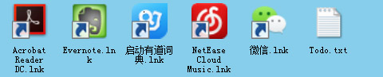

# LightDesktopBin

## 简介
  LightDesktop是一个轻型的桌面，该桌面维护一个工作区内所需要的软件快捷键，文件夹和文件。
  通过鼠标或者键盘来快捷的切换到相关的软件，文件夹或者文件。

  下图是一个阅读工作区实例图：
  
  
  
## 配置工作快捷键及相关文件
1. 选择某图标拖动
2. 按住Shift+Space激活LightDesktop
3. 将图标拖动到LightDesktop

## 使用 
  1. 鼠标点击启动对应的程序 
	  * 鼠标指针变手型，单击启动
  2. 快捷键启动对应的程序
	  * 1,2,3,4,5,6对应不同的程序
	  
## 代码
[C#-代码-Github][github.com].
[github.com]: https://github.com/jamelouis/LightDesktop

## Introduction
LightDesktopBin is a light desktop util for windows, which mantians a workspace of softwares, folders and files.
User can quickly switch to the software, folder, or file by mouse click or keybord.

Take Reading Workspace for example:

  
  
## Configuration
1. Select some Software Icon and drag
2. Press Shift+Space to active LightDesktop
3. Drag icon to the LightDesktop Form

## User Guide
  1. Start Application by Clicking Mouse's Left Button
    * When Mouse's Shape become Hand-Shape, Click Left-Button to start
  2. Start Application by Pressing NumX Key
    * X is 1,2,3,4,5, Press Num1 Key to start first application
    
## Source Code
[C#-Source Code-Github][github.com].

[github.com]: https://github.com/jamelouis/LightDesktop
